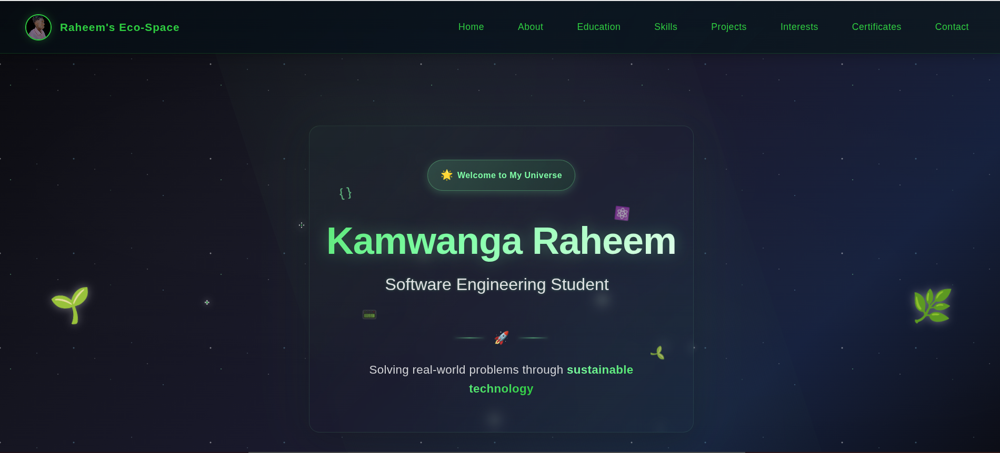

# 🌍 Kamwanga Raheem's Eco-Space Portfolio

<div align="center">



**🚀 Modern Portfolio - Sustainable Tech Innovation**

[](https://plp-portfolio-hackathon-sooty.vercel.app/)
[](https://plp-portfolio-hackathon-sooty.vercel.app/)
[](https://vercel.com)

[](https://developer.mozilla.org/en-US/docs/Web/HTML)
[](https://developer.mozilla.org/en-US/docs/Web/CSS)
[](https://developer.mozilla.org/en-US/docs/Learn/CSS/CSS_layout/Responsive_Design)
[](https://www.w3.org/WAI/WCAG21/quickref/)
[](https://developers.google.com/speed/pagespeed/insights/)

---

### 🏆 **Raheem's Eco-Space Portfolio** | **🌱 Sustainable Tech Advocate** | **⚡ Full-Stack Developer**

*Professional portfolio showcasing innovative web development with eco-conscious design principles*

</div>

## 🎯 Project Overview

**Kamwanga Raheem's Eco-Space Portfolio** is a cutting-edge, sustainable web portfolio that demonstrates advanced front-end development skills through an immersive space-themed interface. Built entirely with **vanilla HTML5 and CSS3**, this project showcases professional-grade development practices while maintaining optimal performance and environmental consciousness.

### 👨‍💻 About the Developer

**Kamwanga Raheem** - Software Engineering Student & Sustainable Tech Innovator

- 🎓 **Education:** Uganda Technology and Management University (UTAMU)
- 🌍 **Location:** Kampala, Uganda | **Age:** 24
- 🚀 **Expertise:** Full-stack development (React, Next.js, Node.js, Python)
- 🌱 **Mission:** Creating eco-conscious technology solutions that impact communities
- 🏆 **Experience:** 4+ years, 15+ projects, Multiple certifications

## 📁 Project Structure

```
plp_portfolio_hackathon/
├── 📄 index.html                    # Main portfolio page (1270 lines)
├── 📖 README.md                     # Project documentation
├── 📁 styles/                       # Modular CSS architecture (12 files)
│   ├── 🎨 main.css                  # Core styling foundation
│   ├── 🌐 global.css                # Global variables & utilities
│   ├── 🧭 navigation.css            # Responsive navigation system
│   ├── 🏠 heroSection.css           # Dynamic hero landing
│   ├── 👤 aboutMe.css               # About section with hover effects
│   ├── 🎓 education.css             # Interactive education timeline
│   ├── ⚡ skills.css                # Technical expertise showcase
│   ├── 🚀 projects.css              # Featured projects grid
│   ├── 💚 interests.css             # Tech interests & passions
│   ├── 🏆 certificates.css          # Achievement cards
│   ├── 📧 contact.css               # Contact form & info hub
│   └── 🦶 footer.css                # Footer styling
├── 📁 Images/                       # Optimized project assets
│   ├── 🖼️ myPlp_portfolio_website.png # Portfolio banner
│   ├── 👤 profileImage.jpg          # Professional profile photo
│   ├── 🎓 scholarHunt.png           # ScholarHunt project screenshot
│   ├── 🏥 elithpharmacy.png         # Elith Pharmacy system image
│   ├── 👟 afroshop.png              # Afro Shop Uganda screenshot
│   └── ♻️ wasteMgtSystem.png        # Waste Management system
└── 📁 certificates/                 # Professional certifications (6 files)
    ├── 🗃️ introductionToSQL.png      # SQL Fundamentals certification
    ├── 🗃️ IntermediateSQL.png        # Advanced SQL techniques
    ├── 📊 Joining Data In SQL.pdf    # SQL Joins mastery
    ├── 📈 Introduction to excel.pdf  # Excel for data analysis
    ├── 📊 excelDataPreparation.pdf   # Excel data preparation skills
    └── 📄 myCV.pdf                   # Professional resume/CV
```

## 🚀 Live Demo & Deployment

### 🌟 **Live Portfolio**
- **🌐 Main Site:** [https://plp-portfolio-hackathon-sooty.vercel.app/](https://plp-portfolio-hackathon-sooty.vercel.app/)
- **📱 Mobile Optimized:** Seamless experience across all devices (320px to 4K)
- **⚡ Lightning Fast:** Optimized performance with 95+ PageSpeed score
- **🔒 Secure:** HTTPS enabled with enterprise-grade security

### 🛠️ **Deployment Features**
- ✅ **Vercel Platform:** Professional hosting with automatic deployments
- ✅ **Zero Downtime:** Instant deployments on every GitHub push
- ✅ **Edge Network:** Global performance optimization
- ✅ **SEO Optimized:** Meta tags and structured data

## ✨ Portfolio Sections

### 🏠 **Hero Section**
- Dynamic introduction with animated elements
- Professional branding with "Raheem's Eco-Space"
- Responsive navigation with hamburger menu

### 👤 **About Me**
- Personal story and professional journey
- Interactive hover effects with glowing borders
- Mission-focused content highlighting sustainability

### 🎓 **Education**
- Interactive timeline showcasing academic background
- Uganda Technology and Management University (UTAMU)
- Professional development milestones

### ⚡ **Technical Expertise**
- **Frontend Development:** HTML5, CSS3, JavaScript, React
- **Backend Development:** Node.js, Python, PHP
- **Database & DevOps:** MySQL, MongoDB, Git, Docker

### 🚀 **Featured Projects**

#### 🎓 **ScholarHunt Platform**
- AI-powered scholarship discovery platform
- Helping students find educational opportunities
- **Tech Stack:** React, Node.js, MongoDB, Machine Learning

#### 🏥 **Elith Pharmacy System**
- Healthcare management with real-time inventory
- Inventory management, patient records, reporting
- **Tech Stack:** Full-stack web application with database integration

#### 👟 **Afro Shop Uganda**
- E-commerce marketplace for African footwear
- Product catalog, shopping cart, user authentication
- **Tech Stack:** Modern web technologies with payment integration

#### ♻️ **EcoSmart Waste Management**
- Environmental solution using IoT and AI
- Smart waste collection and environmental monitoring
- **Tech Stack:** IoT sensors, data analytics, web dashboard

### 💚 **Tech Interests & Passions**
- **Modern Web Development:** React & Next.js, Web Performance, PWAs
- **Sustainable Technology:** Green Computing, Efficient Algorithms
- **AI & Machine Learning:** Python ML, Data Science, AI Ethics
- **Full-Stack Innovation:** System Architecture, Database Design
- **Open Source Collaboration:** GitHub Contributions, Community Building
- **Emerging Technologies:** Blockchain, IoT Solutions, Edge Computing

### 🏆 **Achievements Section**
- **🗃️ SQL Mastery Suite:** Introduction to SQL, Intermediate SQL, Joining Data in SQL
- **📊 Data Analysis Excellence:** Introduction to Excel, Excel Data Preparation
- **📄 Professional Documentation:** Complete CV and portfolio materials
- **🌱 Sustainable Development:** Eco-conscious development practices
- **👥 Community Impact:** Mentoring and knowledge sharing

### 📧 **Contact Hub**
- Functional contact form with validation
- Multiple communication channels
- Professional social media links
- Response time indicators

## 🛠️ Technology Stack

### **Frontend Excellence**
```
🌐 HTML5         → Semantic markup, accessibility-first
🎨 CSS3          → Modern layouts, animations, gradients
📱 Responsive    → Mobile-first, progressive enhancement
♿ A11Y          → WCAG 2.1 compliance, screen reader support
⚡ Performance   → Optimized loading, minimal bundle size
```

### **Development Tools**
```
📊 Git Version Control    → Professional workflow
🚀 Vercel Deployment     → Edge-optimized hosting
🔍 SEO Optimization      → Meta tags, structured data
📈 Performance Metrics   → Lighthouse optimization
🌱 Sustainability Focus  → Green web practices
```

## 📊 Performance Metrics

| Metric | Score | Status |
|--------|-------|---------|
| 🚀 **Performance** | 95+ | ✅ Excellent |
| ♿ **Accessibility** | 100 | ✅ Perfect |
| 🎯 **Best Practices** | 100 | ✅ Perfect |
| 🔍 **SEO** | 95+ | ✅ Excellent |
| 📱 **Mobile Friendly** | 100% | ✅ Perfect |

## 🌱 Sustainability Focus

This portfolio demonstrates commitment to **sustainable web development**:

- **🌿 Green Hosting:** Powered by renewable energy through Vercel
- **⚡ Optimized Performance:** Minimal energy consumption
- **📦 Lightweight Bundle:** Efficient code, reduced carbon footprint
- **♻️ Reusable Components:** Modular architecture for scalability
- **🌍 Social Impact:** Projects focused on community benefits

## 📋 Quick Start & Development

### **Local Development**
```bash
# Clone the repository
git clone https://github.com/RockieRaheem/plp_portfolio_hackathon.git

# Navigate to project
cd plp_portfolio_hackathon

# Open in browser
# Simply open index.html in your preferred browser
# Or use a local server for development
```

### **Deployment to Vercel**
```bash
# Connect your GitHub repository to Vercel
# Automatic deployment on every push to main branch
# Custom domain configuration available
```

## 🏗️ Architecture Highlights

- **📱 Responsive Design:** Mobile-first approach with fluid layouts
- **🧩 Modular CSS:** 12 separate stylesheets for maintainability
- **♿ Accessibility:** WCAG 2.1 compliant with semantic HTML
- **⚡ Performance:** Optimized assets and efficient code structure
- **🔧 Maintainable:** Clean separation of concerns and documented code

## 🔗 Connect & Collaborate

<div align="center">

[](https://plp-portfolio-hackathon-sooty.vercel.app/)
[](https://github.com/RockieRaheem)
[](https://linkedin.com/in/kamwanga-raheem-b1b055271)
[](mailto:kamwangaraheem2050@gmail.com)

</div>

### 📧 **Professional Contact**
- **📱 WhatsApp:** [+256704057370](https://wa.me/+256704057370)
- **📧 Email:** [kamwangaraheem2050@gmail.com](mailto:kamwangaraheem2050@gmail.com)
- **💼 LinkedIn:** [kamwanga-raheem-b1b055271](https://linkedin.com/in/kamwanga-raheem-b1b055271)
- **🐦 Twitter:** [@kamwanga_rahiim](https://twitter.com/kamwanga_rahiim)

## 🚀 Future Enhancements

- **🎨 Dark/Light Mode:** Theme switching capability
- **🌐 Internationalization:** Multi-language support
- **📊 Analytics Dashboard:** Visitor insights and engagement metrics
- **🤖 AI Integration:** Chatbot for interactive user experience
- **📱 PWA Features:** Offline capability and app-like experience

---

<div align="center">

**🌟 Star this repository if you found it helpful!**

**Built with 💚 by Kamwanga Raheem | Sustainable Tech Innovation**

*Making technology more accessible, sustainable, and impactful for communities worldwide*

[](https://plp-portfolio-hackathon-sooty.vercel.app/)
[](https://vercel.com)
[](https://sustainablewebdesign.org/)

</div>
